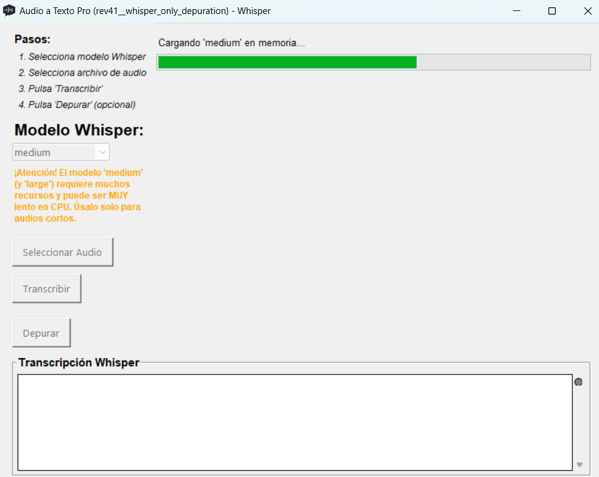

# Audio a Texto Pro - Comparativa Google vs Whisper

Aplicación de escritorio simple para transcribir archivos de audio utilizando dos motores de reconocimiento de voz: Google Speech Recognition (a través de la librería `speech_recognition`) y OpenAI Whisper (ejecutado localmente). Muestra las transcripciones lado a lado para facilitar la comparación.

Originalmente pensado para audios de WhatsApp, ahora funciona con diversos formatos de audio (MP3, WAV, OGG, etc.) gracias a la conversión mediante `pydub` y `ffmpeg`.

<!-- Inserta aquí una captura de pantalla de la aplicación -->
<!-- Ejemplo:  -->

## Características Principales

*   **Selección de Archivo:** Permite seleccionar archivos de audio en formatos comunes (MP3, WAV, OGG...).
*   **Conversión Automática:** Convierte automáticamente los archivos seleccionados a formato WAV estándar (pcm\_s16le) usando `ffmpeg` (requerido) para mayor compatibilidad.
*   **Transcripción Dual:**
    *   **Google Speech Recognition:** Utiliza la API web gratuita (a través de `speech_recognition`) para una transcripción rápida (simulando tiempo real durante la reproducción).
    *   **OpenAI Whisper:** Realiza la transcripción localmente utilizando el modelo `tiny` por defecto (configurable en `config.py`).
*   **Interfaz Comparativa:** Muestra ambas transcripciones en áreas de texto separadas.
*   **Indicadores Visuales:** Muestra el estado del proceso (cargando, transcribiendo, completado, error) para cada motor.
*   **Reproducción (Google):** Reproduce el audio mientras se transcribe con Google.
*   **Funciones Básicas:**
    *   Copiar texto de cada transcripción al portapapeles.
    *   Exportar cada transcripción a un archivo `.txt`.
    *   Opción para detener la transcripción de Google anticipadamente.

## Requisitos

*   **Python:** Versión 3.9 o superior recomendada.
*   **FFmpeg:** **Indispensable**. `pydub` lo requiere para cargar y convertir la mayoría de formatos de audio. Debe estar instalado en tu sistema y accesible desde el PATH del sistema. Puedes descargarlo desde [ffmpeg.org](https://ffmpeg.org/download.html).
*   **Librerías Python:** Las dependencias se listan en `requirements.txt`.

## Instalación y Configuración

1.  **Clonar el Repositorio:**
    ```bash
    git clone https://github.com/ilahuerta-IA/Audio-WhatsApp-a-texto.git
    cd Audio-WhatsApp-a-texto
    ```

2.  **Instalar FFmpeg:** Descarga FFmpeg desde [ffmpeg.org](https://ffmpeg.org/download.html) y sigue las instrucciones para tu sistema operativo. **Asegúrate de añadir `ffmpeg` (y `ffprobe`) al PATH de tu sistema** para que la aplicación pueda encontrarlo.

3.  **Crear un Entorno Virtual (Recomendado):**
    ```bash
    python -m venv venv
    ```
    *   En Windows: `venv\Scripts\activate`
    *   En macOS/Linux: `source venv/bin/activate`

4.  **Instalar Dependencias Python:**
    Asegúrate de tener el archivo `requirements.txt` en la raíz del proyecto con el siguiente contenido (o créalo):
    ```text
    # requirements.txt
    pygame
    SpeechRecognition
    pydub
    openai-whisper
    # Opcional: Si tienes GPU NVIDIA y quieres aceleración para Whisper:
    # 1. Desinstala openai-whisper si ya lo instalaste: pip uninstall openai-whisper
    # 2. Instala PyTorch con CUDA: pip install torch torchvision torchaudio --index-url https://download.pytorch.org/whl/cuXXX (reemplaza cuXXX con tu versión CUDA, ej. cu118, cu121)
    # 3. Reinstala Whisper: pip install openai-whisper
    ```
    Luego ejecuta:
    ```bash
    pip install -r requirements.txt
    ```

## Uso

1.  **Ejecutar la Aplicación:**
    Desde el directorio raíz del proyecto (`Audio-WhatsApp-a-texto`), ejecuta:
    ```bash
    python audio_transcriptor_pro/main.py
    ```
    *Nota: Se ejecuta `main.py` dentro del subdirectorio `audio_transcriptor_pro` debido a la estructura refactorizada.*

2.  **Seleccionar Audio:** Haz clic en el botón "Seleccionar Audio" y elige un archivo de audio compatible.
3.  **Esperar Preparación:** La aplicación puede tardar unos segundos si necesita convertir el archivo a WAV. El estado indicará "Listo para transcribir".
4.  **Transcribir:** Haz clic en el botón "Transcribir".
5.  **Observar:**
    *   La transcripción de Google comenzará primero, acompañada de la reproducción del audio. El indicador de estado de Google se pondrá verde.
    *   Una vez finalizada (o detenida) la parte de Google, comenzará la transcripción con Whisper. El indicador de Whisper mostrará actividad (puntos animados) y se pondrá verde al finalizar (o rojo si hay error).
    *   La etiqueta de estado general mostrará el paso actual.
6.  **Resultados:** Una vez completadas ambas transcripciones, puedes usar los botones "Copiar..." o "Exportar..." para cada resultado.
7.  **Terminar Google:** Si deseas detener la transcripción de Google antes de que termine, usa el botón "Terminar Google". Whisper comenzará igualmente después.

## Estructura del Proyecto (Refactorizada)

El código ha sido organizado en módulos para seguir los principios SOLID, mejorando la legibilidad y mantenibilidad: